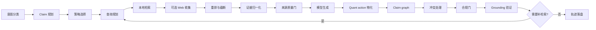

# Qwen3-8B 可审计金融 Agent 技术研究报告

> 文档性质：持续维护的研究主报告（living document）
>
> 文档版本：`0.9.0`
>
> 结果快照：`2026-09-09`（Asia/Shanghai）
>
> 当前候选：SFT v2.7-core Dev-Audit 已选 `checkpoint-153`，adapter 为 `saves/qwen3-8b/lora/sft-v2.7-core-selected`
>
> 当前优化范围：`financial_qa`、`quant_strategy`、`stock_analysis`；`financial_report`、`risk_assessment`、`sentiment_analysis` 不进入 SFT v2.7-core 优化或 gate
>
> 当前决策：**Release Gate = FAIL；v2.8.2 的 full stock-target rewrite 在固定 seen contract preflight 上显著退化，adapter 已拒绝。validator false acceptance 仍为零，但候选池质量不足；禁止 DPO/GRPO。阶段复盘与总体路线见 [`v2.9 Strategy Review`](finllm_v2_9_strategy_review.md)。**

## 1. 摘要

本研究以 Qwen3-8B 为基座，目标不是训练一个只会给出金融文本答案的模型，而是构建一个可审计的金融 Agent：每个结论必须能追溯到具体来源、获取时间和原始证据片段；训练和评测同时检查检索决策、证据质量、Claim-to-Evidence 对齐、数值一致性、合规性及最终分析是否成立；市场收益只能作为有上限的延迟弱反馈，不能覆盖事实或合规失败。

截至本快照，系统已完成 LangGraph Agent、审计 schema、约束优先奖励、SFT v2-v2.6 数据迭代、审计感知加权 CE、source-disjoint Dev-Audit checkpoint 选择，以及 trusted/adversarial regression 和 audit-only selector replay。SFT v2.7-core 仅训练和评测 `financial_qa`、`quant_strategy`、`stock_analysis`，继承 v2.6 的紧凑目标和 quant renderer；其 Dev-Audit 从八个 checkpoint 中选出第 `153` 步，而不是 teacher-forced loss 最低的第 `120` 步。

- Dev-Audit（36 条）：checkpoint-153 的 `E2E@1=69.44%`、`Audit@1=86.11%`、最弱任务 Audit `81.82%`、mean primary `0.7461`；stock_analysis 的 E2E 仅 `33.33%`；
- trusted core regression（150 条，三类各 50）：`E2E@1/@8=57.33%/90.00%`、`Audit@1/@8=74.00%/96.00%`、最弱任务 E2E@8 `78.00%`；总体 primary clustered 95% CI 为 `[+0.0257,+0.1299]`，但 QA/stock primary delta 为 `-0.0466/-0.1318`；
- adversarial core regression（150 条，三类各 50）：`E2E@1/@8=59.33%/86.00%`、`Audit@1/@8=86.00%/97.33%`、最弱任务 E2E@8 `70.00%`；总体 primary clustered 95% CI 为 `[+0.0236,+0.1347]`，但 stock primary delta 为 `-0.2993`；
- audit-only selector E2E：trusted `0.6067`、adversarial `0.6400`，仅恢复 oracle E2E 的 `67.41%/74.42%`；选中样本任务误接收率仍为 `36.81%/34.25%`；
- evidence-anchor task-aware selector：trusted/adversarial 的任务误接受均为 `0`，E2E 为 `0.7867/0.6400`；但对抗 stock E2E 仅 `0.04`，且其在旧 hard-negative preference 上 chosen 接受率仅 `0.7864`；
- `<think>` 非空输出均为 `0`；trusted greedy/8-sample 的长度截断为 `5/14`，adversarial 为 `0/18`。

结果说明 v2.7-core 的采样分布中已有较多正确候选，但单次 Audit@1 未达 95%，QA 和 stock 存在 primary 退化，audit-only selector 也无法可靠地区分审计通过与任务正确。两套 core regression 是既有 seen regression 的切片，不是 untouched final test。v2.8 的完整 calibration 结论见 [`v2.8 Validator Calibration Report`](finllm_v2_8_validator_calibration_report.md)：误接受已被压到零，但 adversarial stock 的正确候选拒绝率仍达 `93.67%`。当前 Release Gate 继续 FAIL，SFT/解码/任务验证器修复优先于正式 RL/GRPO。

## 2. 研究问题与判断

### 2.1 SFT 是否还有提升空间

有，而且空间仍然明确。主要证据是：

1. v2.7-core 的 trusted/adversarial `E2E@8 - E2E@1` 分别为 `0.3267/0.2667`，说明能力经常存在于采样分布中，但单次解码不能稳定落在可审计、任务正确的答案上。
2. quant_strategy 已有 trusted `E2E@1/@8=0.86/1.00` 与 adversarial `0.86/0.94`，而 QA 和 stock 的 primary 出现退化；优先应是任务定向结构化监督，而非扩大统一长答案训练。
3. selector 对 trusted stock 的 E2E 从 greedy `0.52` 降至 `0.34`，且任务误接收率 `66%`；这证明引用/格式审计不能替代 claim 与任务有效性验证。
4. v2.7-core 的最低 loss-eval 在 step 120（`0.00021133`），但按 Dev-Audit 排序选中了 step 153；继续压低 teacher-forced loss 不能替代端到端 checkpoint 选择。

### 2.2 强化学习是否必要

目前只能得出“存在受控稳定性实验的价值”，不能得出“RL 已被证明必要”。v2.7-core 重新评测后，条件如下：

| 条件 | 门槛 | v2.7-core trusted | v2.7-core adversarial | 状态 |
|---|---:|---:|---:|---|
| E2E@8 | `>= 0.80` | `0.9000` | `0.8600` | PASS |
| Audit@8 | `>= 0.95` | `0.9600` | `0.9733` | PASS |
| 最弱任务 E2E@8 | `>= 0.70` | `0.7800` | `0.7000` | PASS（边界） |
| E2E@8 - E2E@1 | `>= 0.15` | `0.3267` | `0.2667` | PASS |

上述启发式满足，只支持“候选质量存在且有稳定性缺口”的假设，并不构成启动 GRPO 的授权。当前 `Audit@1=0.74/0.86`，QA/stock 的 per-task primary 非劣失败，selector 的任务误接收率为 `36.81%/34.25%`。正式 GRPO 之前仍需新的独立 final holdout、可校准的 task-aware verifier 及 reward attack 扩展；若约束解码和 renderer 能解决 @1 差距，RL 不应优先。

quant_strategy 的 artifact 格式不需要 RL：确定性 renderer 已消除动态 Python 生成问题。但 v2.6 出现 action schema/长度回退，trusted `E2E@1/@8=0.52/0.94`，说明固定 action 的精确生成仍需 SFT、grammar/constrained decode 和 validator 修复。RL 不应用来重新学习可编码的格式规则。

## 3. 系统目标与边界

### 3.1 核心目标

- **结论可追溯**：答案中的事实、计算和推断关联 Evidence ID。
- **时间可追溯**：区分信息的发布时间、事实生效时间和系统获取时间。
- **证据可复核**：保存原始片段、内容哈希、文档版本和 chunk 位置。
- **轨迹可评价**：记录是否检索、检索查询、证据归一化、验证和重试过程。
- **事实约束优先**：事实、时点、引用、数值和合规是不可补偿硬门。
- **市场反馈降权**：只允许小幅、有上限的风险调整后延迟反馈。

### 3.2 非目标

- 不监督或要求自由文本长思维链。
- 不允许模型在无证据时补写“合理推断”。
- 不允许市场后验收益挽救事实或合规失败的轨迹。
- 不把低 CE loss、单一 task score 或 pass@8 当作发布充分条件。
- 不让模型动态生成可以由受控程序模板确定产生的 quant Python artifact。

## 4. Agent 与审计架构

核心编排位于 [`scripts/rag/agentic_rag.py`](../scripts/rag/agentic_rag.py)，审计对象位于 [`scripts/rag/audit_schema.py`](../scripts/rag/audit_schema.py)，Reward v2 位于 [`scripts/rag/reward_v2.py`](../scripts/rag/reward_v2.py)。LangGraph 主流程如下：



Agent 状态同时保留 `raw_answer`、物化后的 `answer`、quant action 错误、检索计划、Evidence、Claims、Calculations、合规结果、奖励分解和完整 trajectory。这样 quant action 的错误不会被 renderer 静默掩盖，最终答案也能回溯到模型原始输出。

### 4.1 审计 schema

| 对象 | 关键字段 | 作用 |
|---|---|---|
| EvidenceRecord | source URI、canonical URL、publisher、source type、reliability tier、published/effective/fetched time、exact quote、content hash、document version、chunk offsets | 标识来源、时点与原文证据 |
| ClaimRecord | claim type、statement、supporting/contradicting Evidence IDs、calculation ID、confidence、applicable time、assumptions | 建立 Claim-to-Evidence 映射 |
| CalculationRecord | expression、inputs、result、unit、Evidence IDs | 以受限算术语法复核计算 |
| Trajectory event | step ID、node、action、action args、observation IDs、metrics | 审计检索和验证行为 |

Evidence ID 由规范化来源、片段内容哈希及位置生成。系统明确区分 `published_at`、`effective_at` 与 `fetched_at`；未来发布、未来生效或截至请求时尚未获取的证据不能通过时间硬门。

### 4.2 Quant action + deterministic renderer

SFT v2.5 不再要求模型生成长 Python。模型只允许输出一行严格 JSON：

```json
{"action":"render_quant_artifact","artifact_version":"quant.v2.5","template_id":"ma5_ma20_long_only"}
```

[`scripts/rag/quant_protocol.py`](../scripts/rag/quant_protocol.py) 对 action 做 exact schema/value 校验，再从外部证据确定性渲染 Python artifact。任何额外文本、错误 action、错误版本或错误模板都会失败，不做宽松修复。该拆分把“策略选择”留给模型，把“确定性代码构造”交给可测试程序，是本轮 quant 从 v2.4 的 `E2E@1=0` 提升到 v2.5 的 `E2E@1=1.0` 的主要协议变化。由于评测协议同时发生变化，这个提升是系统级结果，不能只归因于参数训练。

## 5. 奖励设计

Reward v2 采用硬门优先的两阶段结构。以下任一条件触发时，总奖励为 0：

- 缺失、伪造或无效引用；
- 检索不相关、实体不匹配或 Evidence ID 与归一化结果不一致；
- 无依据主张、极性反转、数值不一致或计算记录无效；
- 使用未来或截至请求时不可见的证据；
- 证据元数据缺失、来源冲突未解决；
- “保证收益”“全仓”等禁止性建议；
- quant artifact/action 无效；
- 轨迹缺失、不完整、顺序错误或缺少查询规划/检索动作。

硬门通过后，基础奖励按以下维度加权：检索相关性 `0.14`、主张支持度 `0.20`、数值一致性 `0.12`、引用覆盖 `0.12`、引用精度 `0.10`、来源质量 `0.10`、时间有效性 `0.08`、任务有效性 `0.09`、轨迹质量 `0.05`。延迟市场反馈的绝对贡献上限为 `0.05`，且不能改变硬门失败状态。

当前确定性 reward attack suite 包含 14 个案例，覆盖伪造引用、未来信息、数值篡改、极性反转、无效计算、合规违规、缺失轨迹以及市场奖励不可救援等情形，现有记录为零误接收、零误拒绝。机器可读结果见 [`saves/eval_results/reward_v2_validation.json`](../saves/eval_results/reward_v2_validation.json)。该套件仍需随真实模型失败持续扩展，不能视为 reward 已经完备。

## 6. 数据与 SFT 演进

以下历史结果使用了逐步演进的 prompt/scoring contract，只用于说明失败模式和工程决策，不构成严格同协议排行榜。

| 版本 | 主要变化 | 可信集 E2E/Pass@1 | Audit@1 | Primary delta | 结论 |
|---|---|---:|---:|---:|---|
| v2 | 真实 Agent 轨迹与审计 schema；policy/answer 联合训练 | `0.3867` | `0.4667` | `+0.0724` | policy:answer 约 10:1，且出现 25 条西里尔字符漂移，FAIL |
| v2.1 | policy 与 answer adapter 分离 | `0.1467` | `0.1967` | `-0.0495` | 输出漂移消失，但 primary 非劣失败，FAIL |
| v2.2 | 简洁、审计优先的 answer repair | `0.1200` | `0.1367` | `+0.1082` | primary 改善但审计远低于门槛，FAIL |
| v2.3 | 原子主张、数值原样复制、quant 安全格式、对抗集 | `0.4100` | `0.5733` | `+0.0399` | 总体提升，弱任务 primary 非劣仍失败，FAIL |
| v2.4 hard-negative | no-think、任务平衡、审计 token 加权、hard-negative preference | `0.1700` | `0.5333` | `-0.1492` | @8 仍低且 quant 完全失败，继续 SFT/协议修复 |
| v2.5 | 更短目标、强 EOS、failure repair、quant action renderer | `0.5067` | `0.7133` | `+0.0645` | @8 已高但 @1 审计与 QA 非劣失败，FAIL |
| v2.6 | 压缩 claim 目标、单行拒答、提高引用/EOS 权重、沿用 quant.v2.5 renderer | `0.4967` | `0.6567` | `-0.0082`（CI `[-0.0417,+0.0242]`） | trusted Audit 与任务级 primary 非劣失败；adversarial @8 失败，继续 SFT |

v2-v2.3 的来源结果分别见 [`sft_v2_trusted.json`](../saves/eval_results/sft_v2_trusted.json)、[`sft_v2_1_trusted.json`](../saves/eval_results/sft_v2_1_trusted.json)、[`sft_v2_2_trusted.json`](../saves/eval_results/sft_v2_2_trusted.json) 和 [`sft_v2_3_trusted.json`](../saves/eval_results/sft_v2_3_trusted.json)。v2.4-v2.6 使用 E2E@1/@8 协议，详见第 8 节；各版本的 prompt/scoring contract 仍可能不同。

### 6.1 SFT v2.5 数据快照

| 数据 | 规模与性质 |
|---|---|
| Train | `1620` 条，六类任务各 `270` 条，46 个 source groups |
| Loss-eval | `72` 条，4 个 source groups；仅用于 teacher-forced loss 观测 |
| Dev-Audit | `72` 条，4 个 source groups；与 train/trusted/adversarial source-disjoint |
| 缺证据拒答 | `162` 条 |
| Failure-taxonomy repair | `314` 条，覆盖六类任务 |
| Hard negatives | `1620` 对，覆盖 citation drop、numeric drift、unsupported forecast、long think 和 quant action 错误等 |

训练目标平均 `459.2` 字符，最大 `763` 字符，`<think>` 目标为 0。所有构建后的正样本均通过 audit hard gate、严格数值复制和引用覆盖检查；所有 quant 目标均为固定 action。数据构建报告见 [`data/sft_v2_5/build_report.json`](../data/sft_v2_5/build_report.json)。

需要特别说明：v2.5 hard-negative preference 数据已经生成并验证，但本轮 v2.5 adapter 只执行了 SFT，没有继续执行 DPO。训练从 `sft-v2.4-selected` 开始，而不是从发生过退化的 `sft-v2.4-hardneg-selected` 开始。因此不能把 v2.5 结果归因于 preference optimization。

### 6.2 SFT v2.6 数据快照

| 数据 | 规模与性质 |
|---|---|
| Train | `1620` 条，六类任务各 `270` 条；最大 target `437` 字符 |
| Loss-eval / Dev-Audit | 各 `72` 条；Dev-Audit 与 train、trusted、adversarial source-disjoint |
| Hard negatives | `1620` 对，覆盖全部 train 样本及引用、数值、拒答、长输出和 quant action 失败 |

v2.6 所有正样本均无显式 `<think>`，目标采用紧凑 claim、逐句句末引用和固定拒答模板；quant 继续使用 `quant.v2.5` action + deterministic renderer。引用/关键短语/EOS 权重为 `5.0/5.0/14.0`，学习率 `3e-6`，上下文 `3072`，seed `49`。数据 gate、source-disjoint 和 hard-negative 覆盖检查均通过；机器可读构建报告见 [`data/sft_v2_6/build_report.json`](../data/sft_v2_6/build_report.json)。

### 6.3 SFT v2.7-core 优化范围与数据快照

本轮范围收敛为 `financial_qa`、`quant_strategy`、`stock_analysis`。`financial_report`、`risk_assessment` 与 `sentiment_analysis` 被明确排除出训练、Dev-Audit checkpoint 选择、RL 启发式和下一轮 Release Gate；它们的历史数据与结果保留，只能用于回溯诊断，不能被误解释为 v2.7-core 的能力承诺。

| 数据 | 规模与性质 |
|---|---|
| Train | `810` 条，三类各 `270` 条 |
| Loss-eval / Dev-Audit | `36` 条，QA `16`、quant `11`、stock `9` |
| Hard negatives | `810` 对，与 train 三类一一对应 |
| trusted regression | `150` 条，三类各 `50` 条；seen regression |
| adversarial regression | `150` 条，三类各 `50` 条；seen regression |

数据由已通过审计的 v2.6 三任务子集构建，最大 target `428` 字符；所有目标仍无显式 `<think>`，并通过 audit/no-think、source-disjoint、任务平衡和 hard-negative 覆盖 gate。该范围变更本身不是新的模型结果，不能与 v2.6 六任务聚合指标直接比较。构建制品见 [`v2.7-core build report`](../data/sft_v2_7_core/build_report.json)。

## 7. 训练目标与实现

### 7.1 为什么默认 SFT loss 不完全贴合本任务

标准 causal LM SFT 对所有未 mask 的目标 token 做平均交叉熵。它能学习整体语言分布，但对本任务有三个不足：

1. 长答案天然贡献更多 token loss，短拒答和固定 action 容易被稀释；
2. Evidence ID、数值、拒答关键短语和 EOS 的错误业务代价远高于普通连接词，但标准 CE 权重相同；
3. token CE 不直接理解“一个 claim 是否被证据支持”或“引用是否位于句末”，因此不能替代端到端审计器。

v2.5 在 LLaMA-Factory 中加入 sample-balanced audit-aware CE。对第 `i` 个样本：

```text
L_i = sum_t(w_it * CE_it) / sum_t(w_it)
L   = mean_i(L_i)
```

数值 token、`[E...]` 引用 span、审计/quant 关键短语的权重均为 `4.0`，EOS 权重为 `12.0`。先对每个样本内部归一化，再对样本求平均，避免长目标在 batch 中获得更多总权重。实现见 [`trainer_utils.py`](../LLaMA-Factory/src/llamafactory/train/trainer_utils.py)，配置见 [`qwen3_8b_qlora_sft_v2_5_answer.yaml`](../configs/qwen3_8b_qlora_sft_v2_5_answer.yaml)。

这个 loss 比默认 CE 更贴合当前目标，但仍只是 token-level surrogate：它不保证语义支持、拒答边界或句级引用正确，也不包含 rejected answer 信号。任务平衡来自数据集每类等量，不是 loss 自动实现。最终 checkpoint 必须由独立 Dev-Audit 选择。

### 7.2 v2.5 训练配置与结果

- QLoRA 4-bit，LoRA rank `16`、alpha `32`、dropout `0.05`、target `all`；
- context `4096`，`enable_thinking=false`；
- batch size `1`，gradient accumulation `16`；
- learning rate `4e-6`，cosine schedule，warmup ratio `0.08`；
- 3 epochs，共 `306` steps；每 20 step 保存并评测；
- train runtime `3672.09s`，最终 train loss `0.26730`，最终 loss-eval loss `0.0015587`；
- 无 OOM、NaN 或训练中断。

最低 loss 不是最佳端到端 checkpoint。Dev-Audit 排序依次优先：总体 Audit、最弱任务 Audit、E2E、primary、较少截断、较早 step。

| Checkpoint | Dev E2E@1 | Dev Audit@1 | 最弱任务 Audit | Mean primary | 截断 |
|---|---:|---:|---:|---:|---:|
| **step 80（选中）** | `0.4861` | `0.8472` | `0.7333` | `0.6566` | `7` |
| step 306（最终） | `0.6111` | `0.6806` | `0.4615` | `0.7470` | `4` |

后期模型“更会答”但更不守审计边界。这是当前最重要的训练诊断：teacher-forced loss 与 primary 上升不能替代 audit-first checkpoint selection。

### 7.3 v2.6 训练与 Dev-Audit 选点

- 从 `sft-v2.5-selected` 继续训练，QLoRA 配置保持 rank `16`、alpha `32`、dropout `0.05`；context `3072`，`enable_thinking=false`；
- batch size `1`、gradient accumulation `16`、learning rate `3e-6`、cosine schedule、warmup ratio `0.10`；3 epochs，共 `306` steps，seed `49`；
- train runtime `3560.13s`，最终 train loss `1.15574`，最终 loss-eval loss `0.0043297`；无 OOM、NaN 或训练中断；
- Dev-Audit 按 Audit、最弱任务 Audit、E2E、primary、截断数和较早 step 排序，选中 step `240`，复制为 [`sft-v2.6-selected`](../saves/qwen3-8b/lora/sft-v2.6-selected)。

| Checkpoint | Dev E2E@1 | Dev Audit@1 | 最弱任务 Audit | Mean primary | 截断 |
|---|---:|---:|---:|---:|---:|
| **step 240（选中）** | `0.5278` | `0.6528` | `0.3077` | `0.6735` | `5` |
| step 300 | `0.5278` | `0.6389` | `0.4615` | `0.6962` | `5` |
| step 306（最终） | `0.5000` | `0.5972` | `0.3077` | `0.6649` | `7` |

v2.6 再次显示后期 CE/primary 与审计质量分离；step 240 是审计优先选择，不代表已达到发布标准。

### 7.4 v2.7-core 训练日志分析

v2.7-core 从 `sft-v2.6-selected` 继续训练，保持 QLoRA rank `16`、alpha `32`、dropout `0.05`、4-bit、`enable_thinking=false`、上下文 `3072`、learning rate `3e-6`、cosine schedule、warmup `0.10`；batch size `1`、gradient accumulation `16`、seed `53`。训练集为三任务 `810` 条，完成 `3` epochs、`153` steps；输出目录为 [`sft-v2.7-core-answer`](../saves/qwen3-8b/lora/sft-v2.7-core-answer)。

| 指标 | 结果 | 解释 |
|---|---:|---|
| Final train loss | `0.0095025` | 训练目标已高度拟合，不能作为能力或审计质量指标 |
| 最低 loss-eval | step `120`：`0.00021133` | 仅为 teacher-forced proxy |
| Final loss-eval | `0.00022498` | 比最低值高约 `6.5%`，出现轻微回升 |
| 训练耗时 | `1372.37s` | `1.771` samples/s，`0.111` steps/s |
| 稳定性 | 无 NaN、Inf、OOM 或中断记录 | 训练过程本身有效 |
| Trainer best checkpoint | 未设置 | `load_best_model_at_end=false`，不可把最终 step 当作候选 |

loss-eval 从 step `20` 的 `0.00191142` 下降至 step `120` 的 `0.00021133`，之后 step `140` 为 `0.00023073`、最终为 `0.00022498`。这不是严重发散，但与 v2.6 的经验一致：低 token loss 不足以证明引用、数值复制和 quant action 的端到端正确性。必须以 source-disjoint core Dev-Audit 对八个 checkpoint（`20/40/60/80/100/120/140/153`）进行生成式选择，再运行 paired regression。

## 8. 可信评测方法

### 8.1 数据治理层级

| 数据集 | 当前用途 | 是否可用于最终发布声明 |
|---|---|---|
| `sft_v2_6_dev_audit.json` | v2.6 六任务 checkpoint 选择 | 否，属于开发集 |
| `sft_v2_7_core_dev_audit.json` | v2.7-core 三任务 source-disjoint checkpoint 选择 | 否，属于开发集 |
| `trusted_finance_v2.json` | 300 条、六类各 50 条 regression；v2.6 已运行 | 否，已在 v2.5/v2.6 开发中查看/使用 |
| `sft_v2_3_audit_adversarial.json` | 300 条审计对抗 regression；v2.6 已运行 | 否，属于 seen regression |
| v2.7-core trusted/adversarial slices | 各 150 条、三类各 50 条；v2.7-core 回归 | 否，由上述 seen regression 切片得到 |
| 全新 core final holdout | 尚未建立；三类各至少 50 条 | 是，建立并冻结后才可用于最终声明 |

可信与对抗 regression 均与 v2.6/v2.7-core 训练数据保持直接 source overlap 为 0，但“无直接泄漏”不等于“未参与开发”。当前报告中的两组结果及其 v2.7-core 切片只能称为 regression，不能称为 untouched test。

### 8.2 指标定义

- `Primary score`：任务正确性/覆盖的连续分数。
- `Audit`：引用、主张支持、数值、时间、合规和协议硬门是否全部通过。
- `E2E`：Audit 通过且 Primary 达到该 case 的通过阈值。
- `@1`：temperature 0 的单次 greedy 输出。
- `@8`：temperature `0.6`、top-p `0.9` 的 8 个候选中是否至少一个通过；这是 oracle pass 指标，不包含线上 selector 的选择误差与成本。
- `Primary non-inferiority`：candidate 与同 prompt 基座逐 case 配对，按 source group 聚类 bootstrap；95% CI 下界要求 `>= -0.02`。

每次评测 manifest 记录数据 fingerprint、gold hash、模型 revision、adapter weight hash、prompt contract hash、生成参数和所有逐 case 输出。评测器拒绝 prompt、模型、数据或生成配置不一致的续跑文件。

## 9. SFT 回归结果

### 9.1 总体结果

来源：[`sft_v2_5_trusted_regression_e2e.json`](../saves/eval_results/sft_v2_5_trusted_regression_e2e.json)。

| 指标 | 同协议 Qwen3-8B 基座 | SFT v2.5 | 判断 |
|---|---:|---:|---|
| E2E@1 | `0.1367` | `0.5067` | 改善 |
| E2E@8 | - | `0.9267` | RL 候选能力门槛通过 |
| Audit@1 | `0.1367` | `0.7133` | 改善但未达发布门槛 |
| Audit@8 | - | `0.9833` | RL 候选能力门槛通过 |
| Mean primary@1 | `0.5758` | `0.6403` | `+0.0645` |
| Primary delta clustered 95% CI | - | `[0.0313, 0.0973]` | 总体非劣通过 |
| Length finish@1 | `26/300` | `14/300` | 改善 |
| 非空 `<think>`@1 | - | `0/300` | 通过 |

v2.4 hard-negative adapter 在同一 gold、但 v2.4 prompt/quant contract 下的结果为 E2E@1 `0.1700`、E2E@8 `0.6333`、Audit@1 `0.5333`、Audit@8 `0.8167`、primary delta `-0.1492`（95% clustered CI `[-0.1897,-0.1074]`）。v2.5 的方向性改善很大，但由于 prompt contract 和 quant materialization 已改变，不能把两个版本当作只改变 adapter 权重的严格 A/B。

### 9.2 分任务结果

| Task | E2E@1 | E2E@8 | Audit@1 | Audit@8 | Primary@1 delta |
|---|---:|---:|---:|---:|---:|
| financial_qa | `0.20` | `0.88` | `0.60` | `1.00` | `-0.1065` |
| financial_report | `0.76` | `1.00` | `0.90` | `1.00` | `+0.0059` |
| quant_strategy | `1.00` | `1.00` | `1.00` | `1.00` | `+0.1642` |
| risk_assessment | `0.50` | `0.92` | `0.68` | `0.98` | `+0.2179` |
| sentiment_analysis | `0.24` | `0.84` | `0.58` | `0.98` | `+0.0911` |
| stock_analysis | `0.34` | `0.92` | `0.52` | `0.94` | `+0.0143` |

### 9.3 Greedy 失败诊断

以下数字是 300 条可信 regression 中“受影响 case 数”，同一 case 可命中多个错误：

| 失败模式 | Case 数 | 主要集中任务 |
|---|---:|---|
| unsupported claim | `60` | sentiment `20`、financial_qa `19`、stock `9` |
| 引用未置于句末 | `39` | stock `22`、risk `11` |
| citation coverage 不足 | `25` | financial_qa/sentiment 各 `7` |
| 缺失引用 | `22` | sentiment `6`、financial_qa/stock 各 `5` |
| numeric mismatch | `20` | financial_qa `5`，其余非 quant 任务分散 |
| invalid citation | `11` | financial_qa `5`、sentiment `3` |
| 达到长度上限 | `14` | financial_report/stock 各 `6` |

quant_strategy 在上述类别中均为 0，验证了“固定 action + renderer”对确定性协议任务的有效性。其余任务仍让模型直接生成多句自然语言，句级引用和支持关系没有被结构化 renderer 强制保证。

### 9.4 SFT v2.6 总体结果

来源：[`trusted result`](../saves/eval_results/sft_v2_6_trusted_regression_e2e.json) 与 [`adversarial result`](../saves/eval_results/sft_v2_6_adversarial_regression_e2e.json)。v2.6 使用独立的 `sft_v2.6_e2e.v1` prompt/scoring contract；以下数值只与同一 v2.6 协议下的基座配对，不与 v2.5 做无条件 A/B。

| 指标 | v2.6 trusted 基座 | v2.6 trusted candidate | v2.6 adversarial 基座 | v2.6 adversarial candidate |
|---|---:|---:|---:|---:|
| E2E@1 | `0.0167` | `0.4967` | `0.0067` | `0.3433` |
| E2E@8 | - | `0.8000` | - | `0.6433` |
| Audit@1 | `0.0167` | `0.6567` | `0.0067` | `0.5433` |
| Audit@8 | - | `0.9400` | - | `0.8967` |
| Mean primary@1 | `0.6281` | `0.6198` | `0.5217` | `0.4921` |
| Primary delta clustered 95% CI | - | `-0.0082` `[-0.0417,+0.0242]` | - | `-0.0296` `[-0.0667,+0.0079]` |
| E2E@8 - E2E@1 | - | `0.3033` | - | `0.3000` |
| 最弱任务 E2E@8 | - | `0.4600`（sentiment） | - | `0.2800`（financial_report） |

两组结果均满足 E2E@1 相对基座不下降，但 trusted 未达到 Audit@1 `95%`、Audit@8 `95%` 和 primary 非劣效；adversarial 还未达到 E2E@8 `80%` 与最弱任务 `70%`。v2.6 的 `@8` 候选存在性没有转化为可审计的单次稳定输出。

### 9.5 SFT v2.6 分任务结果

| Task | trusted E2E@1/@8 | trusted Audit@1/@8 | adversarial E2E@1/@8 | adversarial Audit@1/@8 |
|---|---:|---:|---:|---:|
| financial_qa | `0.34/0.62` | `0.56/0.82` | `0.64/0.94` | `0.70/0.98` |
| financial_report | `0.84/1.00` | `0.90/1.00` | `0.06/0.28` | `0.16/0.60` |
| quant_strategy | `0.52/0.94` | `0.52/0.94` | `0.72/0.94` | `0.72/0.94` |
| risk_assessment | `0.52/0.82` | `0.72/1.00` | `0.22/0.62` | `0.46/0.94` |
| sentiment_analysis | `0.10/0.46` | `0.42/0.88` | `0.14/0.44` | `0.50/0.92` |
| stock_analysis | `0.66/0.96` | `0.82/1.00` | `0.28/0.64` | `0.72/1.00` |

trusted primary delta 的明显负向任务为 sentiment_analysis `-0.1523` 与 financial_qa `-0.0777`；adversarial 负向任务为 financial_report `-0.1773`、risk_assessment `-0.1734` 和 stock_analysis `-0.2048`。这表明下一轮数据应优先加入对抗式拒答、逐句引用和事实覆盖样本，而不是扩大通用长答案。

### 9.6 SFT v2.6 greedy 失败诊断

以下为受影响 case 数，同一 case 可命中多个错误：

| 失败模式 | trusted | adversarial | 主要集中任务 |
|---|---:|---:|---|
| unsupported claim | `83` | `97` | trusted sentiment/quant/QA；adversarial report/risk/sentiment |
| numeric mismatch | `48` | `83` | trusted quant；adversarial report/quant/risk |
| 数值 lexeme 未原样复制 | `29` | `60` | trusted risk/QA/sentiment；adversarial report |
| citation coverage 不足 | `29` | `29` | 两集均以 quant action 失败为主 |
| 缺失引用 | `12` | `21` | trusted sentiment/risk；adversarial stock/report/risk |
| invalid quant artifact | `24` | `14` | quant_strategy |
| quant action schema/JSON/长度错误 | `24` | `14` | quant_strategy；错误集合有重叠 |

v2.6 最大的新回退是 quant action 没有稳定保持单行精确 JSON；renderer 本身并未失败。非 quant 任务的首要问题仍是 unsupported claim 与数值复制，和进入 RL 前应先修复的错误类型一致。

### 9.7 SFT v2.6 audit-only selector replay

现有审计器只使用 hard-gate、protocol error、audit failure、audit score、finish reason 和答案长度选择候选，不读取 task score、primary score 或 gold。结果如下：

| 数据 | Greedy E2E | Oracle E2E@8 | Selector E2E | Oracle recovery | 任务误接收率 |
|---|---:|---:|---:|---:|---:|
| trusted | `0.4967` | `0.8000` | `0.5400` | `0.6750` | `0.4255` |
| adversarial | `0.3433` | `0.6433` | `0.4233` | `0.6580` | `0.5279` |

selector 能提高审计安全选择率，但只能恢复约三分之二的 oracle E2E，且大量审计通过答案在任务正确性上仍是假阳性。当前 audit-only verifier 不能直接用作生产 selector 或 GRPO reward；下一步必须加入不依赖 gold、但能校准任务有效性的 verifier 信号。

### 9.8 SFT v2.7-core checkpoint 选择与 paired regression

来源：[`v2.7-core Dev-Audit selection`](../saves/eval_results/sft_v2_7_core_dev_checkpoints/selection.json)、[`trusted result`](../saves/eval_results/sft_v2_7_core_trusted_regression_e2e.json) 与 [`adversarial result`](../saves/eval_results/sft_v2_7_core_adversarial_regression_e2e.json)。此版本仅覆盖 QA、quant、stock；150 条 trusted 与 150 条 adversarial 集均为既有 regression 的三任务切片，直接 source overlap 为 0，但不可称为 untouched final test。

八个 checkpoint 按 Audit@1、最弱任务 Audit、E2E@1、mean primary、截断数、较早 step 排序。选中 step 153（Audit `0.8611`、最弱任务 Audit `0.8182`）；step 80 虽有同样的 Audit `0.8611`，但最弱任务 Audit 为 `0.8125`，故未选中。选择结果与 loss-eval 最低的 step 120 不同。

| 指标 | trusted 基座 | trusted candidate | adversarial 基座 | adversarial candidate |
|---|---:|---:|---:|---:|
| E2E@1 | `0.0333` | `0.5733` | `0.0133` | `0.5933` |
| E2E@8 | - | `0.9000` | - | `0.8600` |
| Audit@1 | `0.0333` | `0.7400` | `0.0133` | `0.8600` |
| Audit@8 | - | `0.9600` | - | `0.9733` |
| Mean primary@1 | `0.6145` | `0.6949` | `0.5765` | `0.6579` |
| Primary delta clustered 95% CI | - | `+0.0804` `[+0.0257,+0.1299]` | - | `+0.0814` `[+0.0236,+0.1347]` |
| E2E@8 - E2E@1 | - | `0.3267` | - | `0.2667` |
| 最弱任务 E2E@8 | - | `0.7800`（QA） | - | `0.7000`（stock） |

### 9.9 SFT v2.7-core 分任务与 selector replay

| Task | trusted E2E@1/@8 | trusted Audit@1/@8 | trusted primary delta | adversarial E2E@1/@8 | adversarial Audit@1/@8 | adversarial primary delta |
|---|---:|---:|---:|---:|---:|---:|
| financial_qa | `0.34/0.78` | `0.46/0.88` | `-0.0466` | `0.78/0.94` | `0.90/0.98` | `+0.1185` |
| quant_strategy | `0.86/1.00` | `0.86/1.00` | `+0.4197` | `0.86/0.94` | `0.86/0.94` | `+0.4250` |
| stock_analysis | `0.52/0.92` | `0.90/1.00` | `-0.1318` | `0.14/0.70` | `0.82/1.00` | `-0.2993` |

trusted QA 的低 Audit@1 是总体 Audit@1 未达标的主要来源；stock 在两个数据集都呈现 audit 高、primary 低的反向信号，尤其 adversarial stock 的 E2E@1 仅 `0.14`。这与“格式或引用看似合格，但结论本身不成立”的 verifier 缺口一致。

| 数据 | Greedy E2E | Oracle E2E@8 | Selector E2E | Audit-safe selection | Oracle recovery | 任务误接收率 |
|---|---:|---:|---:|---:|---:|---:|
| trusted | `0.5733` | `0.9000` | `0.6067` | `0.9600` | `0.6741` | `0.3681` |
| adversarial | `0.5933` | `0.8600` | `0.6400` | `0.9733` | `0.7442` | `0.3425` |

selector 的 trusted stock E2E 为 `0.34`，低于 greedy 的 `0.52`，且 stock 选中样本的任务误接收率为 `0.66`。因此审计器不应被用于线上 best-of-8 策略、DPO 偏好标签或 GRPO reward；下一轮必须先加 task-aware claim validator，并在 chosen/rejected hard negatives 上测量其排序准确性和 reward attack false accept。

### 9.10 v2.7-core evidence-anchor task-aware selector

为解决 audit-only 的任务误接受，新增 [`task-aware validator`](../scripts/evaluation/task_aware_verifier_v2_7_core.py) 和 [`selector replay`](../scripts/evaluation/replay_sft_v2_7_core_task_selector.py)。它在选择时只读取 audit verifier 字段、用户可见 task type/evidence 与候选文本；明确禁止读取 gold `scoring`、task score、primary score、passed 或任何 gold assertion。QA 必须逐项复制已报告的资产负债率和流动比率；stock 必须覆盖价格/收益、趋势、风险与至少一个财务锚点；quant 必须是 canonical action。每个非 quant 原子内容行必须引用有效 Evidence ID，非空 `<think>` 和前瞻预测直接拒绝。

| 数据 | audit-only selector E2E | task-aware E2E | task-aware selection rate | task-aware false accept | Oracle recovery |
|---|---:|---:|---:|---:|---:|
| trusted | `0.6067` | `0.7867` | `0.7867` | `0.0000` | `0.8741` |
| adversarial | `0.6400` | `0.6400` | `0.6400` | `0.0000` | `0.7442` |

task-aware trusted 的 QA/quant/stock E2E 分别为 `0.78/1.00/0.58`；adversarial 为 `0.94/0.94/0.04`。因此它在 seen regression 上消除了 audit-only 的误接受，但对抗 stock 的 `48/50` 拒绝显示其召回不足，不能部署或用作 reward。

在 810 对既有 hard-negative preference 上，第一轮发现 `49` 个 citation-drop rejected 被误接受；将每个原子内容行的有效 citation 加入 hard gate 后，rejected false accept 降为 `0/810`。但 chosen accept 仅为 `0.7864`（173 个 false reject），故 preference gate 仍 FAIL。归因不是放宽即可消除的噪声：69 个 QA chosen prompt 不含可见 evidence，104 个 stock chosen target 不含 MA/趋势锚点，均与当前 verifier 合同冲突。旧 preference 只能用于诊断，不能作为该 verifier 的偏好训练或资格验证数据。

## 10. Release Gate 与当前决策

| Release 条件 | 门槛/规则 | v2.6 结果 | 状态 |
|---|---|---|---|
| Audit@1 | `>= 0.95` | trusted `0.6567`；adversarial `0.5433` | **FAIL** |
| 总体 primary 非劣 | clustered 95% CI lower `>= -0.02` | trusted `-0.0417`；adversarial `-0.0667` | **FAIL** |
| 每任务 primary 非劣 | 每类 delta `>= -0.02` | trusted sentiment `-0.1523`；adversarial stock `-0.2048` | **FAIL** |
| E2E@1 不低于基座 | candidate `>=` baseline | trusted `0.4967 > 0.0167`；adversarial `0.3433 > 0.0067` | PASS |
| v2.6 对抗 regression | 必须满足 RL 候选门槛 | E2E@8 `0.6433`，最弱任务 `0.2800` | **FAIL** |
| untouched final holdout | 六类各至少 50 条 | 尚未建立 | **PENDING** |

因此当前 Release Gate 明确为 **FAIL**。满足 RL stability heuristic 与满足产品发布门槛是两个独立判断，前者不能覆盖后者。

### 10.1 v2.7-core gate 变更

v2.7-core gate 只对三项核心任务计算总体、每任务 primary 非劣、最弱任务 E2E@8 与 Audit@1/@8；`financial_report`、`risk_assessment`、`sentiment_analysis` 不计入该版本 gate，也不构成该版本发布范围。它不改变 v2.6 六任务 Release FAIL 的历史结论，也不允许将三任务结果外推为全金融 Agent 的发布声明。

| Release 条件 | 门槛/规则 | v2.7-core 结果 | 状态 |
|---|---|---|---|
| Audit@1 | `>= 0.95` | trusted `0.7400`；adversarial `0.8600` | **FAIL** |
| 总体 primary 非劣 | clustered 95% CI lower `>= -0.02` | trusted `+0.0257`；adversarial `+0.0236` | PASS |
| 每任务 primary 非劣 | 每类 delta `>= -0.02` | trusted QA `-0.0466`、stock `-0.1318`；adversarial stock `-0.2993` | **FAIL** |
| E2E@1 不低于基座 | candidate `>=` baseline | trusted `0.5733 > 0.0333`；adversarial `0.5933 > 0.0133` | PASS |
| 对抗 E2E@8 与最弱任务 | `>= 0.80` / `>= 0.70` | `0.8600` / `0.7000` | PASS（最弱任务边界） |
| audit-only selector | task false accept 必须足够低 | trusted/adversarial `0.3681/0.3425` | **FAIL** |
| task-aware selector | false accept 低且所有核心任务有可用召回 | seen regression `0.0000/0.0000`，但 adversarial stock E2E `0.0400`；preference chosen accept `0.7864` | **FAIL** |
| untouched core final holdout | 三类各至少 50 条 | 尚未建立 | **PENDING** |

因此 v2.7-core 的 Release Gate 仍明确为 **FAIL**，RL Gate 亦为 **FAIL**。task-aware verifier 已不再把 seen regression 的错误候选选出，但其对抗 stock 召回和 preference chosen 接受不达标；以它直接训练 GRPO 仍会把 verifier 缺口转化为错误偏好。

## 11. 下一阶段实验计划

### P0：既有证据链诊断（回归已完成；final holdout 待补）

1. 已运行 v2.5 的 300 条审计对抗 regression：`E2E@1=0.3533`、`E2E@8=0.7400`、`Audit@1=0.7600`、`Audit@8=0.9667`，最弱任务 `E2E@8=0.5200`，primary CI `[-0.0284,0.0214]`；RL 条件 FAIL。
2. 已完成 trusted/adversarial 上的 audit-only selector replay。trusted selector E2E `0.6100`（oracle recovery `0.6583`），对抗 selector E2E `0.3600`（oracle recovery `0.4865`），task false accept rate `0.6276`；selector 不能替代 task verifier。
3. 全新 final holdout 仍未建立；现有 30 个 held-out issuers 已参与 regression，不能宣称 untouched。对当前原始目录重新枚举得到 `111` 个财报/行情共有发行人，其中仅 `86` 个通过 snapshot 完整性检查，且这 `86` 个已全部进入 train 或现有 regression，未发现可直接冻结的 reserve issuer。需要采集新发行人/来源、人工证据复核和冻结哈希。

### P1：v2.7-core checkpoint 选择与可信回归（已完成）

1. 已对 `20/40/60/80/100/120/140/153` 八个 checkpoint 运行固定 greedy Dev-Audit，并按 Audit、最弱任务 Audit、E2E、primary、截断和较早 step 排序；step 153 被选中，未按 train/loss-eval 最低值直接选择。
2. 已对 selected checkpoint 串行运行 150 条 trusted 与 150 条 adversarial core paired E2E@1/@8，完整指标见 9.8/9.9。
3. 已对两套 @8 生成运行 audit-only selector replay；task false accept 为 `36.81%/34.25%`，禁止将该 selector 用作部署策略、DPO 偏好标签或 RL reward。
4. 评测命令按 Release Gate 的预期以 exit code `1` 结束，但完整 JSON 已成功落盘；这是 gate FAIL 信号，而非推理作业异常。

### P2：三任务 SFT 与解码协议修复（条件执行）

1. 已完成第一版 evidence-anchor task-aware validator 与 selector replay：seen regression 误接受为零，但对抗 stock 召回和 810 对 preference chosen 接受不达标，不能用于部署、DPO 或 GRPO。
2. 重建三任务 verifier-aligned preference：所有 QA chosen/rejected 必须带完整可见 evidence；所有 stock chosen 必须包含带引用的价格/收益、趋势、风险和财务锚点；每个 negative type 都要有标签、预期拒绝原因和 source-group 信息。旧的 69 QA evidence-empty 和 104 stock trend-empty chosen 必须被替换，而非被当作正例继续使用。
3. 在新 preference 上预注册 verifier gate：rejected false-accept `=0`、chosen accept `>=0.95`、每个 core task 均通过；再在新独立对抗集上要求 false accept 足够低且 adversarial stock E2E 不低于 greedy。任何一项失败均禁止 DPO/GRPO。
4. 仅对 QA、quant、stock 构建 failure replay：QA 强化逐值原样复制、逐主张证据和证据不足拒答；quant 强化短的固定字段 action JSON；stock 强化逐句引用、claim action 与禁止价格外推。优先抽取 trusted QA 和 adversarial stock 的失败样本。
5. 将 stock 的非结构化自然语言拆为结构化 claim action + deterministic renderer；renderer 只处理格式，禁止补写模型未选择的事实或预测。
6. 引入 task-specific token budget、EOS/stop contract、quant grammar/JSON constrained decode 和 validator-triggered regeneration；在相同生成预算下比较 greedy、constrained decode 与 task-aware selector，不能只报 oracle @8。
7. 补充新的独立发行人/来源，冻结三类各至少 `50` 条 core final holdout；现有 trusted/adversarial 只能用于回归与开发诊断。

### P3：条件式 GRPO 稳定性试验

只有对抗 regression 也满足 @8 条件、reward selector 能可靠识别好候选、且新增 reward attacks 通过后，才启动受控 GRPO。建议：

- 从届时通过 Dev-Audit 的最新 SFT checkpoint 开始，不从已知退化的 hard-negative adapter 开始；
- 首轮排除 quant artifact 格式奖励；固定 action 先通过 SFT、grammar 和 validator 修复；
- reward 的事实、时点、引用、数值和合规门保持不可补偿；
- 延迟市场反馈继续限制在 `0.05`，不得救援硬门失败；
- 与同一 SFT checkpoint 的 constrained decode/selector 做同预算对照；
- 任何总体提升若伴随单任务 primary、拒答校准或对抗 Audit 退化，均不得晋级。

## 12. 可复现命令

```bash
# 数据 gate
/home/super/.conda/envs/finllm/bin/python \
  scripts/data_processing/build_sft_v2_5_dataset.py

# 训练（本快照已完成）
PYTORCH_CUDA_ALLOC_CONF=expandable_segments:True \
  bash scripts/training/train_sft_v2_5.sh --skip-build

# Dev-Audit checkpoint 选择（本快照已完成）
/home/super/.conda/envs/finllm/bin/python \
  scripts/evaluation/select_sft_v2_5_checkpoint.py \
  --checkpoint-dir saves/qwen3-8b/lora/sft-v2.5-answer \
  --selected-output saves/qwen3-8b/lora/sft-v2.5-selected \
  --gold data/evaluation/sft_v2_5_dev_audit.json \
  --output-dir saves/eval_results/sft_v2_5_dev_checkpoints \
  --batch-size 24 --max-tokens 900

# 可信 regression（本快照已完成；Release Gate 失败时返回码 1）
/home/super/.conda/envs/finllm/bin/python \
  scripts/evaluation/eval_sft_v2_5_e2e.py \
  --gold data/evaluation/trusted_finance_v2.json \
  --adapter saves/qwen3-8b/lora/sft-v2.5-selected \
  --train-file data/sft_v2_5/fin_agentic_sft_v2_5_answer_train.json \
  --output saves/eval_results/sft_v2_5_trusted_regression_e2e.json

# 审计对抗 regression（v2.5 已完成；Release Gate 失败时返回码 1）
/home/super/.conda/envs/finllm/bin/python \
  scripts/evaluation/eval_sft_v2_5_e2e.py \
  --gold data/evaluation/sft_v2_3_audit_adversarial.json \
  --adapter saves/qwen3-8b/lora/sft-v2.5-selected \
  --train-file data/sft_v2_5/fin_agentic_sft_v2_5_answer_train.json \
  --output saves/eval_results/sft_v2_5_adversarial_regression_e2e.json

# SFT v2.6 数据 gate 与训练（本快照已完成）
/home/super/.conda/envs/finllm/bin/python \
  scripts/data_processing/build_sft_v2_6_dataset.py
bash scripts/training/train_sft_v2_6.sh --skip-build

# SFT v2.6 Dev-Audit checkpoint 选择（本快照已完成；选中 step 240）
/home/super/.conda/envs/finllm/bin/python \
  scripts/evaluation/select_sft_v2_6_checkpoint.py \
  --checkpoint-dir saves/qwen3-8b/lora/sft-v2.6-answer \
  --selected-output saves/qwen3-8b/lora/sft-v2.6-selected \
  --gold data/evaluation/sft_v2_6_dev_audit.json \
  --output-dir saves/eval_results/sft_v2_6_dev_checkpoints \
  --batch-size 24 --max-tokens 900

# SFT v2.6 trusted regression（本快照已完成；Release Gate 失败时返回码 1）
/home/super/.conda/envs/finllm/bin/python \
  scripts/evaluation/eval_sft_v2_6_e2e.py \
  --gold data/evaluation/trusted_finance_v2.json \
  --adapter saves/qwen3-8b/lora/sft-v2.6-selected \
  --train-file data/sft_v2_6/fin_agentic_sft_v2_6_answer_train.json \
  --output saves/eval_results/sft_v2_6_trusted_regression_e2e.json

# SFT v2.6 adversarial regression（本快照已完成；Release Gate 失败时返回码 1）
/home/super/.conda/envs/finllm/bin/python \
  scripts/evaluation/eval_sft_v2_6_e2e.py \
  --gold data/evaluation/sft_v2_3_audit_adversarial.json \
  --adapter saves/qwen3-8b/lora/sft-v2.6-selected \
  --train-file data/sft_v2_6/fin_agentic_sft_v2_6_answer_train.json \
  --output saves/eval_results/sft_v2_6_adversarial_regression_e2e.json

# SFT v2.6 audit-only selector replay
/home/super/.conda/envs/finllm/bin/python \
  scripts/evaluation/replay_sft_v2_6_selector.py \
  --input saves/eval_results/sft_v2_6_trusted_regression_e2e.json \
  --output saves/eval_results/sft_v2_6_trusted_selector_replay.json
/home/super/.conda/envs/finllm/bin/python \
  scripts/evaluation/replay_sft_v2_6_selector.py \
  --input saves/eval_results/sft_v2_6_adversarial_regression_e2e.json \
  --output saves/eval_results/sft_v2_6_adversarial_selector_replay.json

# 关键回归测试
/home/super/.conda/envs/finllm/bin/python -m pytest -q \
  tests/test_sft_v2_6.py tests/test_sft_v2_5.py \
  tests/test_sft_v2_5_selector.py tests/test_agentic_rag.py \
  tests/test_audit_reward_v2.py tests/test_audit_weighted_loss.py
```

```bash
# SFT v2.7-core 数据 gate（已完成）
/home/super/.conda/envs/finllm/bin/python \
  scripts/data_processing/build_sft_v2_7_core_dataset.py

# SFT v2.7-core 训练（本快照已完成）
bash scripts/training/train_sft_v2_7_core.sh --skip-build --dry-run
bash scripts/training/train_sft_v2_7_core.sh --skip-build

# SFT v2.7-core Dev-Audit checkpoint 选择
/home/super/.conda/envs/finllm/bin/python \
  scripts/evaluation/select_sft_v2_7_core_checkpoint.py \
  --checkpoint-dir saves/qwen3-8b/lora/sft-v2.7-core-answer \
  --selected-output saves/qwen3-8b/lora/sft-v2.7-core-selected \
  --gold data/evaluation/sft_v2_7_core_dev_audit.json \
  --output-dir saves/eval_results/sft_v2_7_core_dev_checkpoints \
  --batch-size 24 --max-tokens 900

# SFT v2.7-core paired trusted/adversarial regression
/home/super/.conda/envs/finllm/bin/python \
  scripts/evaluation/eval_sft_v2_7_core_e2e.py \
  --gold data/evaluation/sft_v2_7_core_trusted_regression.json \
  --adapter saves/qwen3-8b/lora/sft-v2.7-core-selected \
  --train-file data/sft_v2_7_core/fin_agentic_sft_v2_7_core_answer_train.json \
  --output saves/eval_results/sft_v2_7_core_trusted_regression_e2e.json
/home/super/.conda/envs/finllm/bin/python \
  scripts/evaluation/eval_sft_v2_7_core_e2e.py \
  --gold data/evaluation/sft_v2_7_core_adversarial_regression.json \
  --adapter saves/qwen3-8b/lora/sft-v2.7-core-selected \
  --train-file data/sft_v2_7_core/fin_agentic_sft_v2_7_core_answer_train.json \
  --output saves/eval_results/sft_v2_7_core_adversarial_regression_e2e.json

# SFT v2.7-core audit-only selector replay（已完成）
/home/super/.conda/envs/finllm/bin/python \
  scripts/evaluation/replay_sft_v2_7_core_selector.py \
  --input saves/eval_results/sft_v2_7_core_trusted_regression_e2e.json \
  --output saves/eval_results/sft_v2_7_core_trusted_selector_replay.json
/home/super/.conda/envs/finllm/bin/python \
  scripts/evaluation/replay_sft_v2_7_core_selector.py \
  --input saves/eval_results/sft_v2_7_core_adversarial_regression_e2e.json \
  --output saves/eval_results/sft_v2_7_core_adversarial_selector_replay.json

# SFT v2.7-core task-aware selector 与 preference verifier（已完成；当前 gate FAIL）
/home/super/.conda/envs/finllm/bin/python \
  scripts/evaluation/replay_sft_v2_7_core_task_selector.py \
  --input saves/eval_results/sft_v2_7_core_trusted_regression_e2e.json \
  --gold data/evaluation/sft_v2_7_core_trusted_regression.json \
  --output saves/eval_results/sft_v2_7_core_trusted_task_selector_replay.json
/home/super/.conda/envs/finllm/bin/python \
  scripts/evaluation/replay_sft_v2_7_core_task_selector.py \
  --input saves/eval_results/sft_v2_7_core_adversarial_regression_e2e.json \
  --gold data/evaluation/sft_v2_7_core_adversarial_regression.json \
  --output saves/eval_results/sft_v2_7_core_adversarial_task_selector_replay.json
/home/super/.conda/envs/finllm/bin/python \
  scripts/evaluation/validate_sft_v2_7_core_task_validator.py
```

GPU 训练与 vLLM 推理应串行执行。正式运行前先使用各入口的 `--dry-run` 或 `--validate-only` 检查数据、adapter、source overlap 和输出续跑契约。

## 13. 关键制品与哈希

| 制品 | SHA-256 |
|---|---|
| v2.5 train | `46d1d5500280e3166b7c3dca3cb368f8efe63d87656447697a081c83791bea5c` |
| v2.5 adversarial regression result | `39f4d1d3c686e0e6c017e74cdf4967832d1c0e69ba08ffdef2972a20cfb591a1` |
| v2.5 adversarial selector replay | `c004b64ae8a68aaa37ef1fdc7a4eaeda1ce9ee6bbd02e6a1f3ae278939724f2d` |
| v2.5 trusted selector replay | `34dca80a237cc56a1b1d8cf957052a746319b8f204322d63a4d0861a36795236` |
| v2.6 build report | `f5e4b14a673de0297d7d3b08547607469ddebc9c00b35bb3a71ac5add7847a50` |
| v2.6 train | `3670a4340b97a6d01ba848af461ca7e68eeb0b3893c94a9f3eef2064537476fa` |
| v2.6 loss-eval | `a22d8bdc5c9c50c86b2d4efc07b4d951592c94b7c81f5010106bd9e3d9b312f1` |
| v2.6 Dev-Audit | `4e0b9b996afc2b4171bab55c854347e96b53e5f3e75c6d946d69e486091dff23` |
| v2.6 hard-negative preference | `6287cc1b63d608576ea436d5984aa6b267ec0b4ffe2e661d6bf35abdad78189a` |
| v2.6 checkpoint selection | `b560d189dd67918a224a8735a13799d39111dba035f1da14507d55cd7f947b02` |
| v2.6 selected adapter weights | `f54167f27087f7011cd13dfbd0f61c1e1914b880391d12db68840e9da0942cc1` |
| v2.6 trusted regression result | `3615cb98bbdbed8acb4cb7c946c642be997ffdcbddbd03a344c6d8a2e7bf54e0` |
| v2.6 adversarial regression result | `869f7eaa35b5452526d57137341dd2400bcef036ee257bfb61ccf3f963053a76` |
| v2.6 trusted selector replay | `6716d3adc78ca6d3af59b87991b31383124c6df7f7d4ae6dfc52721159c2ed6c` |
| v2.6 adversarial selector replay | `9635150584e1435254b93047ee386fe0507d0778e1e2ce65051dea1397296bdf` |
| v2.7-core train | `10cb9a5519830b616a29dfb5549259fbc680fc4e3df0a85179f4c429c44057dd` |
| v2.7-core loss-eval | `28f25cf2426db9721c5efa5e15e5828d1ecfd31d3940ad2ad831049c3ecee1e0` |
| v2.7-core build report | `f87c1759155877e0f348c3349ce412225e516572a42a6b064e85a7cc8cc50ce0` |
| v2.7-core Dev-Audit | `cef465ed910908277f813ab0b950c437f7a05ba1cb7b5d07019111282c1a5db9` |
| v2.7-core trusted regression | `9578cf98aab0099fe1f2c14d1e22fa6d17161487e28b463c7264262e170c01e3` |
| v2.7-core adversarial regression | `475d8e80389cf8cc6a72a886b73e0e41414a9b32db6b3f3fe70188f767cf0728` |
| v2.7-core hard-negative preference | `e5342e05bb8a3e6f26705473b8f752978bf401787283dde25fe21f81ed985288` |
| v2.7-core final adapter weights | `96a3cd6eea08254b8e6285eb5cff6eab9122df11e9eab04f5b3152288c9d0a6c` |
| v2.7-core trainer state | `d5471e23a7dad530c95eee5502cfd00940902341dff9db92a79a9a8885cb985e` |
| v2.7-core training summary | `c90cfab4ee78363a80d024ddee8371c65e751d680812b5e66e46231c5270da67` |
| v2.7-core trainer log | `528574c8797b5eac64c4fb1737683cef614c02b1c369c78356dc588714adf1b2` |
| v2.7-core checkpoint selection | `967bac47c185a58104e6c6b1341f52e48dd572baf69c738e1d24f998585477ea` |
| v2.7-core trusted regression result | `8eef134e1d41b518170b5b6079ec32b05d3cd874045b6947b7b370b901985676` |
| v2.7-core adversarial regression result | `7e2b83ee44c4ffcb4e40d2737fc09ccbc7ba89c9dfae7f98a49da3ed622800a3` |
| v2.7-core trusted selector replay | `722286a70423553e599b8d9f856140823d638720c5f9b1812867663fc6e162d3` |
| v2.7-core adversarial selector replay | `12f35335fc4f5a6e6999117c30973dfc37571f2a6dc93fc3c91c0b2ecf68ac9c` |
| v2.7-core task validator preference check | `3ca575a0dfbf8a2441c73565df5a63e31ccf6a2eae9294d5d813f2951e372685` |
| v2.7-core trusted task-aware selector replay | `461d7f2cbdda0d388eb4f2a4e54777e9106622e049ccd2cd57472fb60835618e` |
| v2.7-core adversarial task-aware selector replay | `1a78ffd81804af0b70b43cbb77a9d39463aadd00217ebfe1103094dbd9669e99` |
| v2.5 loss-eval | `3cffe55f09b38e2623d03da5b9e9508f2648f2114cc3c502f0892deca1a322c0` |
| v2.5 hard-negative preference | `78274c9c7677ac0f16c7ee5824cb5cfa6256104690ef3bc5d885bfc2258e4b67` |
| v2.5 Dev-Audit | `6c9c158571cdf795b62c57041c5f2ff32cf0ae3c06beb8fdb04ce6ac01f67309` |
| trusted_finance_v2 gold | `ed9d55cfff9accde8b4eb6d761987c0dc7ad67e04abc505a6e570f227f971258` |
| audit adversarial gold | `63e7cd74c41b903c0d443ab91d0194bcb26206c8fabb1f2ebcc7475893c3b747` |
| v2.5 selected adapter weights | `27178df8381d15cab376ac5f08c74fb3a5943fe6734e03cf120d889f7bdcccbf` |
| v2.5 trusted regression result | `8b45efa2d51679b2a906e65f0d46003a04f1a269c4ce826c72d13f79081462db` |

注意：带时间戳或绝对路径的 manifest 在迁移环境后可能产生新文件哈希；判断实验身份时应同时核对内部 dataset fingerprint、gold hash、adapter weight hash、prompt contract 和 generation settings。

## 14. 持续维护规范

本报告采用“结论快照 + 追加式实验台账”。后续实验完成后：

1. 更新首页文档版本、结果快照、当前候选和当前决策。
2. 在第 15 节追加一行实验记录，不静默改写历史结果。
3. 将完整指标留在机器可读 JSON；正文只提取决策所需指标并链接原始制品。
4. 必须记录 parent adapter、代码/config、数据哈希、prompt/scoring contract、随机种子和解码参数。
5. 明确数据身份：Dev、seen regression、adversarial regression 或 untouched final holdout。
6. 同时报告总体值、最弱任务值、@1/@8、聚类 CI、截断、过度拒答和主要失败类型。
7. 若评分器或 renderer 改变，创建新 protocol version；不得与旧协议结果做无条件直接比较。
8. 若修正历史错误，保留原值并在变更记录中注明原因、影响制品和重算结果。

推荐实验 ID：`EXP-YYYYMMDD-NN`。每个实验至少记录：

```text
实验 ID / 日期：
假设：
唯一主要改动：
Parent model/adapter + SHA-256：
Train/Dev/Test 身份与 SHA-256：
代码 commit / dirty-worktree 说明：
训练配置与 seed：
解码/评分协议版本：
E2E@1/@8、Audit@1/@8、最弱任务、primary delta clustered 95% CI：
失败类型与人工抽检：
Release Gate / RL Gate：
决策与下一步：
制品路径：
```

## 15. 实验台账

| 实验 ID | 日期 | 变更 | 主要结果 | 决策 | 制品 |
|---|---|---|---|---|---|
| EXP-20260908-01 | 2026-09-08 | SFT v2.5：短目标、audit-aware CE、强 EOS、quant action renderer；Dev-Audit 选 checkpoint 80 | trusted regression E2E `0.5067/0.9267`，Audit `0.7133/0.9833`，primary clustered CI `[0.0313,0.0973]`；QA delta `-0.1065` | Release FAIL；完成对抗 regression 与新 holdout 后再决定 GRPO pilot | [`selection.json`](../saves/eval_results/sft_v2_5_dev_checkpoints/selection.json)、[`trusted result`](../saves/eval_results/sft_v2_5_trusted_regression_e2e.json) |
| EXP-20260908-02 | 2026-09-08 | v2.5 审计对抗 regression | E2E `0.3533/0.7400`，Audit `0.7600/0.9667`，最弱任务 E2E@8 `0.5200`，primary CI `[-0.0284,0.0214]` | Release/RL FAIL；继续 SFT、协议和 verifier 修复 | [`adversarial result`](../saves/eval_results/sft_v2_5_adversarial_regression_e2e.json) |
| EXP-20260908-03 | 2026-09-08 | audit-only verifier selector replay | trusted E2E `0.6100`、对抗 E2E `0.3600`；对抗 task false accept `0.6276` | selector 不能替代 task verifier；不启动 RL | [`trusted selector`](../saves/eval_results/sft_v2_5_trusted_selector_replay.json)、[`adversarial selector`](../saves/eval_results/sft_v2_5_adversarial_selector_replay.json) |
| EXP-20260909-01 | 2026-09-09 | SFT v2.6 compact claim/abstention repair；1620 条平衡 train、短目标、提高 citation/EOS 权重 | 训练 306 steps；Dev-Audit 选 step 240：E2E `0.5278`、Audit `0.6528`、最弱任务 Audit `0.3077` | 完成 trusted/adversarial 配对评测后判定 | [`v2.6 build report`](../data/sft_v2_6/build_report.json)、[`selection.json`](../saves/eval_results/sft_v2_6_dev_checkpoints/selection.json) |
| EXP-20260909-02 | 2026-09-09 | v2.6 trusted regression | E2E `0.4967/0.8000`，Audit `0.6567/0.9400`，最弱任务 E2E@8 `0.4600`，primary CI `[-0.0417,0.0242]` | Release/RL FAIL；继续 SFT、解码和 verifier 修复 | [`trusted result`](../saves/eval_results/sft_v2_6_trusted_regression_e2e.json) |
| EXP-20260909-03 | 2026-09-09 | v2.6 adversarial regression | E2E `0.3433/0.6433`，Audit `0.5433/0.8967`，最弱任务 E2E@8 `0.2800`，primary CI `[-0.0667,0.0079]` | Release/RL FAIL；不启动 DPO/GRPO | [`adversarial result`](../saves/eval_results/sft_v2_6_adversarial_regression_e2e.json) |
| EXP-20260909-04 | 2026-09-09 | v2.6 audit-only selector replay | trusted/adversarial E2E `0.5400/0.4233`；oracle recovery `0.6750/0.6580`；任务误接收率 `0.4255/0.5279` | audit-only selector 不足以生产部署或充当 RL reward | [`trusted selector`](../saves/eval_results/sft_v2_6_trusted_selector_replay.json)、[`adversarial selector`](../saves/eval_results/sft_v2_6_adversarial_selector_replay.json) |
| EXP-20260909-05 | 2026-09-09 | 冻结 SFT v2.7-core 三任务范围：QA、quant、stock；排除 report、risk、sentiment | 数据 gate PASS：810 train、36 Dev-Audit、810 hard negatives；trusted/adversarial 均为三类各 50 条切片；训练与评测入口 dry-run PASS | 启动三任务 SFT 后，以 core-only Dev-Audit 和 paired regression 决定下一步；不将结果外推至排除任务 | [`v2.7-core build report`](../data/sft_v2_7_core/build_report.json)、[`v2.7-core config`](../configs/qwen3_8b_qlora_sft_v2_7_core_answer.yaml) |
| EXP-20260909-06 | 2026-09-09 | SFT v2.7-core：从 v2.6-selected 对三任务继续 QLoRA SFT | 3 epochs、153 steps；train loss `0.0095025`；最低 loss-eval 为 step 120 的 `0.00021133`，最终 `0.00022498`；无 NaN/Inf/OOM/中断 | 不按 loss 或 final checkpoint 选模型；先运行八 checkpoint 的 core Dev-Audit | [`trainer state`](../saves/qwen3-8b/lora/sft-v2.7-core-answer/trainer_state.json)、[`training summary`](../saves/qwen3-8b/lora/sft-v2.7-core-answer/all_results.json) |
| EXP-20260909-07 | 2026-09-09 | v2.7-core Dev-Audit：八 checkpoint 固定 greedy 选点 | 选 step 153：E2E `0.6944`、Audit `0.8611`、最弱任务 Audit `0.8182`、primary `0.7461`；与最低 loss-eval step 120 不同 | 使用 selected adapter 跑三任务 paired regression；Dev-Audit 不构成 release 证据 | [`selection.json`](../saves/eval_results/sft_v2_7_core_dev_checkpoints/selection.json) |
| EXP-20260909-08 | 2026-09-09 | v2.7-core trusted/adversarial paired regression 与 audit-only selector replay | trusted E2E `0.5733/0.9000`、Audit `0.7400/0.9600`；adversarial E2E `0.5933/0.8600`、Audit `0.8600/0.9733`；QA/stock per-task primary 退化；selector false accept `0.3681/0.3425` | Release/RL FAIL；继续 SFT、解码协议和 task-aware verifier，禁止 DPO/GRPO | [`trusted`](../saves/eval_results/sft_v2_7_core_trusted_regression_e2e.json)、[`adversarial`](../saves/eval_results/sft_v2_7_core_adversarial_regression_e2e.json)、[`selector replay`](../saves/eval_results/sft_v2_7_core_trusted_selector_replay.json) |
| EXP-20260909-09 | 2026-09-09 | v2.7-core evidence-anchor task-aware selector 与 810 对 preference validator | seen trusted/adversarial selector false accept `0/0`，E2E `0.7867/0.6400`；对抗 stock E2E `0.0400`；preference rejected false accept `0/810`，chosen accept `0.7864` | verifier qualification FAIL；重建 evidence-complete、trend-aligned preference 与新对抗集，禁止 DPO/GRPO | [`validator check`](../saves/eval_results/sft_v2_7_core_task_validator_preference_check.json)、[`trusted replay`](../saves/eval_results/sft_v2_7_core_trusted_task_selector_replay.json)、[`adversarial replay`](../saves/eval_results/sft_v2_7_core_adversarial_task_selector_replay.json) |
| EXP-20260909-10 | 2026-09-09 | v2.8 validator calibration：全量 confusion matrix、173 rejected-chosen taxonomy、stock 专项归因、637 对对齐 preference | candidate-pool FA `0`；v2.8 preference chosen accept `1.0000`、rejected FA `0/637`；但 adversarial stock correct-rejected `93.67%`、selector E2E `0.0400` | **FAIL**；重建 stock gold/对抗合同并收集 token logprob，禁止 DPO/GRPO | [`v2.8 report`](finllm_v2_8_validator_calibration_report.md)、[`matrix`](../saves/eval_results/sft_v2_8_validator_calibration/validator_confusion_matrix.json) |
| EXP-20260909-11 | 2026-09-09 | v2.8.1 stock contract preflight：50 条、25 issuer、严格 price/trend/risk/financial anchor scorer；E2E 支持 sequence NLL | 与训练 issuer 重叠 `0`，但与 trusted regression 文档重叠 `50/50`；仅静态 preflight PASS，未运行 GPU 推理 | 不能作为 final holdout 或 RL 证据；采集新 issuer/source 后重建独立 stock gold | [`preflight report`](finllm_v2_8_1_stock_contract_preflight_report.md)、[`gold report`](../data/evaluation/sft_v2_8_stock_contract_seen_preflight_report.json) |
| EXP-20260909-12 | 2026-09-09 | v2.8.2：一轮全量 stock four-anchor/缺 MA 拒答 repair SFT，固定 seed stock contract preflight + selector | E2E@1/@8 `0.16/0.68 -> 0.08/0.28`，Audit@8 `0.94 -> 0.80`，primary CI `[-0.2943,-0.0482]`；selector FA `0`、oracle recovery `1.00` | **Reject adapter**；候选池退化而非 validator 过严，回到 v2.7-core selected 并做小质量受控消融，禁止 RL | [`repair report`](finllm_v2_8_2_stock_contract_repair_report.md)、[`diagnostic`](../saves/eval_results/sft_v2_8_2_stock_contract_seen_preflight_diagnostic.json) |

## 16. 变更记录

| 文档版本 | 日期 | 变更 |
|---|---|---|
| `0.8.0` | 2026-09-09 | 关联 v2.8 validator calibration、对齐 preference 和 stock 专项诊断；确认 false acceptance 已下降但 recall/protocol blocker 仍使 Release/RL FAIL。 |
| `0.8.1` | 2026-09-09 | 新增 stock contract seen preflight 与 sequence-NLL 采集/诊断；确认 current heldout evidence 已出现在 trusted regression，不能伪作最终独立评测。 |
| `0.8.2` | 2026-09-09 | 记录 v2.8.2 一轮 stock contract repair 训练与 paired preflight 回归；确认 full target rewrite 造成候选池严重退化，拒绝 adapter。 |
| `0.7.0` | 2026-09-09 | 新增 evidence-anchor task-aware selector、810 对 hard-negative validator gate 与误接受归因；确认 citation-drop 漏洞已封闭，但 verifier qualification 仍 FAIL。 |
| `0.6.0` | 2026-09-09 | 记录 v2.7-core Dev-Audit 选点、trusted/adversarial paired regression 与 selector replay；确认 Release/RL 双 FAIL，并将下一步收敛到三任务 SFT/解码/任务验证器修复。 |
| `0.5.0` | 2026-09-09 | 记录 SFT v2.7-core 完整训练与 loss 曲线诊断；将下一步锁定为 core Dev-Audit checkpoint 选择、paired regression 与 selector replay。 |
| `0.4.0` | 2026-09-09 | 冻结 SFT v2.7-core 三任务优化范围；新增 core-only 数据、Dev-Audit、回归切片、训练/评测入口与范围专用 gate。 |
| `0.3.0` | 2026-09-09 | 完成 SFT v2.6 训练、Dev-Audit 选点、trusted/adversarial regression 及 selector replay；记录 Release/RL 双 FAIL、制品哈希与下一轮定向 SFT/解码计划。 |
| `0.2.0` | 2026-09-09 | 纳入 v2.5 对抗 regression、selector replay；记录 final holdout 仍缺失；启动 SFT v2.6 compact claim/abstention 修复并加入复现命令。 |
| `0.1.0` | 2026-09-08 | 首次汇总 Agent/audit/reward 架构、SFT v2-v2.5 演进、v2.5 训练与可信 regression，并建立持续补充规范。 |
